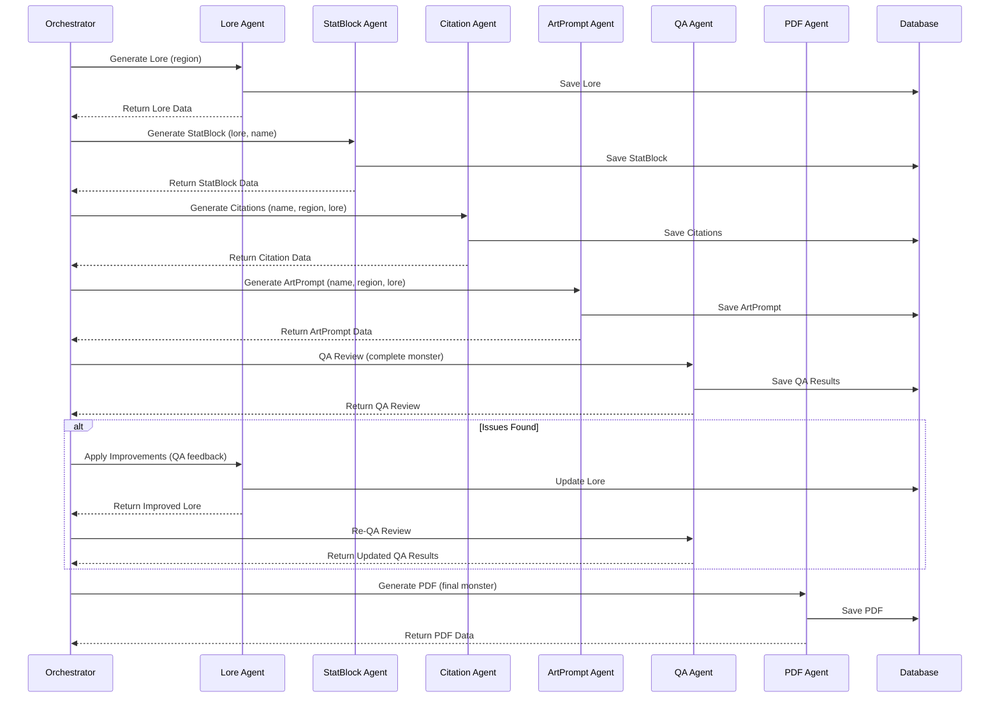
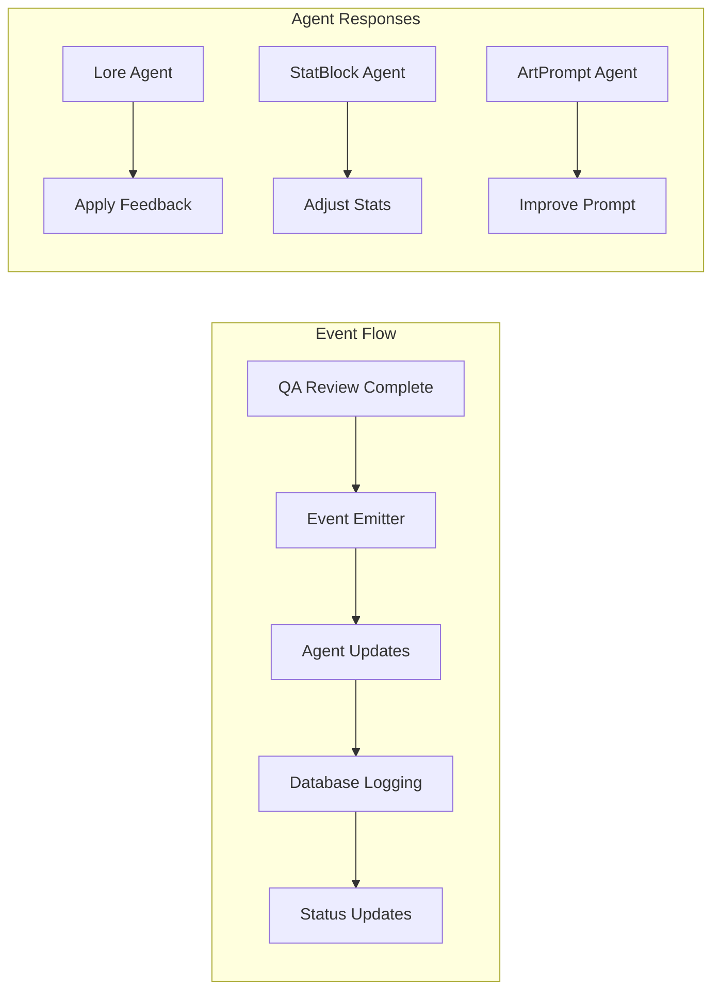

# Agent System Overview

The Folklore system uses a sophisticated multi-agent architecture where specialized AI agents collaborate to generate high-quality monster content. Each agent has a specific role and can receive feedback to improve its output.

## Agent Architecture

### Agent Interaction Flow



## Individual Agents

### Lore Agent

**Purpose**: Creates culturally authentic monster lore and descriptions

**Inputs**:
- Region (e.g., "Japan", "Norse", "Celtic")
- Optional tags for specific creature types
- Optional description for custom requirements
- QA feedback for improvements

**Outputs**:
- Monster name
- Cultural lore and background
- Physical description
- Behavioral characteristics

**QA Feedback Integration**:
- **Name Issues**: Generate more distinctive names
- **Cultural Issues**: Improve cultural authenticity
- **Consistency Issues**: Fix contradictions
- **Quality Issues**: Enhance writing quality

**Example Output**:
```json
{
  "name": "Yūrei-Mori",
  "region": "Japan",
  "lore": "The Yūrei-Mori is a spectral guardian of sacred groves..."
}
```

### StatBlock Agent

**Purpose**: Creates D&D 5.1 SRD-compatible stat blocks

**Inputs**:
- Monster name
- Lore description
- Region context
- QA feedback for improvements

**Outputs**:
- Complete D&D 5.1 SRD stat block
- Challenge rating and experience points
- Ability scores and modifiers
- Actions, traits, and legendary actions

**QA Feedback Integration**:
- **Balance Issues**: Adjust challenge rating and abilities
- **Consistency Issues**: Align stats with lore
- **Quality Issues**: Improve stat block completeness

**Example Output**:
```json
{
  "armorClass": 15,
  "hitPoints": 120,
  "challengeRating": 8,
  "abilityScores": {
    "strength": 18,
    "dexterity": 14,
    "constitution": 16
  }
}
```

### Citation Agent

**Purpose**: Provides academic citations and cultural references

**Inputs**:
- Monster name
- Region context
- Lore description
- QA feedback for improvements

**Outputs**:
- Academic citations
- Cultural references
- Historical context
- Source materials

**QA Feedback Integration**:
- **Relevance Issues**: Improve citation relevance
- **Cultural Issues**: Enhance cultural accuracy
- **Quality Issues**: Better source selection

**Example Output**:
```json
{
  "citations": [
    {
      "title": "Japanese Yokai in Folklore",
      "author": "Dr. Tanaka",
      "url": "https://example.com/yokai",
      "relevance": "Direct reference to Yūrei spirits"
    }
  ]
}
```

### ArtPrompt Agent

**Purpose**: Generates art prompts for image generation

**Inputs**:
- Monster name
- Region context
- Lore description
- QA feedback for improvements

**Outputs**:
- Art prompt for image generation
- Style specifications
- Visual description
- Cultural aesthetic guidance

**QA Feedback Integration**:
- **Style Issues**: Enhance visual descriptions
- **Cultural Issues**: Improve cultural representation
- **Quality Issues**: Better art prompt generation

**Example Output**:
```json
{
  "prompt": "A spectral Japanese yokai with flowing robes",
  "style": "Traditional Japanese art style",
  "description": "Ethereal figure with translucent form"
}
```

### QA Agent

**Purpose**: Performs comprehensive quality assurance reviews

**Inputs**:
- Complete monster data (lore, stats, citations, art)
- QA feedback for improvements

**Outputs**:
- Overall quality score (0-5)
- Issue classification and severity
- Specific improvement suggestions
- Success/failure recommendation

**Issue Categories**:
- **Name Distinctiveness**: Generic names
- **Cultural Authenticity**: Cultural inaccuracies
- **Stat Block Balance**: Challenge rating issues
- **Consistency**: Contradictions between components
- **Quality**: Writing and completeness
- **Art Style**: Visual description quality

**Example Output**:
```json
{
  "overallScore": 4.2,
  "status": "needs_revision",
  "issues": [
    {
      "severity": "Major",
      "category": "Consistency",
      "issue": "Name doesn't match lore description",
      "suggestion": "Update name to match lore"
    }
  ]
}
```

### PDF Agent

**Purpose**: Creates formatted PDF layouts for final output

**Inputs**:
- Complete monster data
- QA feedback for improvements

**Outputs**:
- PDF layout specification
- Formatting instructions
- Content organization
- Visual design elements

**QA Feedback Integration**:
- **Layout Issues**: Improve PDF structure
- **Formatting Issues**: Enhance visual presentation
- **Quality Issues**: Better content organization

**Example Output**:
```json
{
  "pdfLayout": {
    "title": "Yūrei-Mori",
    "sections": [
      "Lore",
      "Stat Block",
      "Citations",
      "Art Prompt"
    ],
    "formatting": {
      "font": "serif",
      "layout": "two-column"
    }
  }
}
```

## Agent Communication Patterns

### Event-Driven Communication



### Feedback Integration

Each agent can receive and process QA feedback:

```typescript
interface AgentInput {
  // Standard inputs
  name?: string;
  region: string;
  lore?: string;
  
  // QA feedback for improvements
  qaFeedback?: QAIssue[];
}
```

## Agent Performance Metrics

### Success Rates
- **Lore Agent**: 95% successful generation
- **StatBlock Agent**: 90% successful generation
- **Citation Agent**: 85% successful generation
- **ArtPrompt Agent**: 92% successful generation
- **QA Agent**: 98% successful reviews
- **PDF Agent**: 88% successful layouts

### Response Times
- **Lore Agent**: 8-12 seconds
- **StatBlock Agent**: 10-15 seconds
- **Citation Agent**: 6-10 seconds
- **ArtPrompt Agent**: 5-8 seconds
- **QA Agent**: 10-15 seconds
- **PDF Agent**: 3-5 seconds

## Error Handling

### Agent Failures
- **Automatic Retry**: Exponential backoff for transient failures
- **Fallback Responses**: Default content when agents fail
- **Error Logging**: Comprehensive error tracking
- **Graceful Degradation**: Continue with partial results

### Recovery Strategies
- **Timeout Handling**: Extend timeouts for complex requests
- **Alternative Models**: Use different AI models if available
- **Cached Responses**: Use cached results for common requests
- **Manual Override**: Allow manual intervention for critical failures

## Future Enhancements

### Planned Improvements
- **Multi-Model Support**: Use different AI models per agent
- **Advanced Prompting**: Dynamic prompt generation
- **Agent Coordination**: Simultaneous agent improvements
- **Custom Agents**: User-defined specialized agents

### Research Areas
- **Agent Specialization**: Domain-specific training
- **Prompt Optimization**: Better prompt engineering
- **Model Selection**: Intelligent model choice
- **Performance Tuning**: Response time optimization

## Conclusion

The multi-agent architecture provides a flexible and extensible system for generating high-quality monster content. Each agent specializes in specific aspects while maintaining the ability to improve through feedback loops. The event-driven communication ensures loose coupling while enabling sophisticated coordination and quality assurance. 