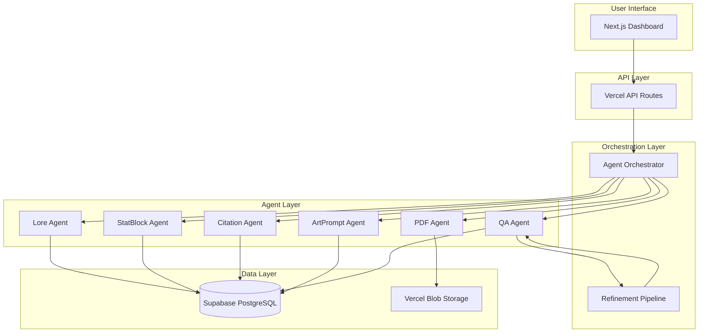
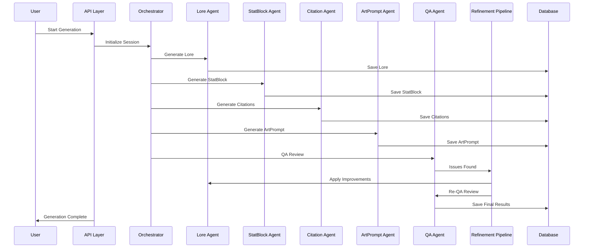
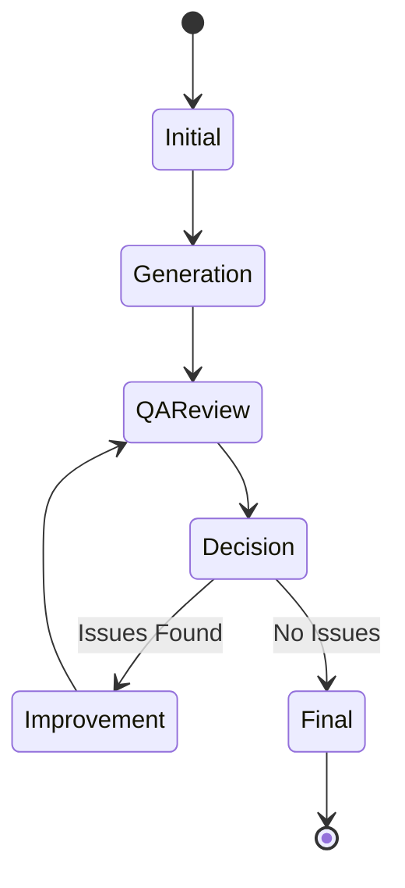

# System Architecture Overview

The Folklore monster generation system is built on a modular, event-driven architecture that combines multiple AI agents with a sophisticated refinement pipeline.

## System Components

### Core Architecture

## Component Descriptions

### User Interface Layer
- **Next.js Dashboard**: Comprehensive web interface for monitoring and managing monster generation
- **Real-time Updates**: WebSocket integration for live status updates
- **Documentation**: Integrated documentation system with Mermaid diagrams

### API Layer
- **Vercel API Routes**: Serverless functions for handling HTTP requests
- **Authentication**: Supabase Auth integration for user management
- **Rate Limiting**: Protection against API abuse
- **Error Handling**: Comprehensive error responses and logging

### Orchestration Layer
- **Agent Orchestrator**: Coordinates the execution of multiple AI agents
- **Refinement Pipeline**: Manages iterative improvement process
- **Session Management**: Tracks generation and refinement sessions
- **Event System**: Decoupled communication between components

### Agent Layer
- **Lore Agent**: Generates cultural lore and monster descriptions
- **StatBlock Agent**: Creates D&D 5.1 SRD-compatible stat blocks
- **Citation Agent**: Provides academic citations and references
- **ArtPrompt Agent**: Generates art prompts for image generation
- **QA Agent**: Performs quality assurance reviews
- **PDF Agent**: Creates formatted PDF layouts

### Data Layer
- **Supabase PostgreSQL**: Primary database for monsters, sessions, and metadata
- **Vercel Blob Storage**: File storage for PDFs and images
- **Vector Search**: Semantic search capabilities using pgvector

## Data Flow

### Monster Generation Flow

### Refinement Pipeline Flow

## Design Principles

### Modularity
- Each agent operates independently
- Clear separation of concerns
- Easy to add new agents or modify existing ones

### Event-Driven Architecture
- Decoupled communication through events
- Asynchronous processing where possible
- Real-time status updates

### Observability
- Comprehensive logging at all levels
- Session tracking and metrics
- Error handling and recovery

### Scalability
- Serverless architecture for automatic scaling
- Database optimization for high throughput
- Caching strategies for performance

## Technology Stack

### Frontend
- **Next.js**: React framework with TypeScript
- **Tailwind CSS**: Utility-first CSS framework
- **WebSocket**: Real-time communication
- **Mermaid**: Diagram rendering

### Backend
- **Vercel Functions**: Serverless API endpoints
- **TypeScript**: Type-safe development
- **OpenAI API**: Primary AI provider
- **OpenRouter**: Unified AI provider (planned)

### Database
- **Supabase**: PostgreSQL with real-time features
- **pgvector**: Vector similarity search
- **Row Level Security**: Data protection

### Storage
- **Vercel Blob**: File storage for PDFs and images
- **Supabase Storage**: Alternative file storage

### Monitoring
- **Vercel Analytics**: Performance monitoring
- **Custom Logging**: Application-specific metrics
- **Error Tracking**: Comprehensive error reporting

## Security Considerations

### Authentication
- Supabase Auth for user management
- API key management for AI providers
- Environment variable protection

### Data Protection
- Row Level Security in database
- Input validation and sanitization
- Rate limiting for API endpoints

### Privacy
- No sensitive data in logs
- Secure API key handling
- GDPR compliance considerations

## Performance Characteristics

### Response Times
- **Generation**: 30-60 seconds for complete monster
- **Refinement**: 15-30 seconds per iteration
- **API Calls**: <2 seconds for individual operations
- **Database Queries**: <100ms for standard operations

### Scalability
- **Concurrent Users**: Designed for 100+ simultaneous users
- **Database**: Optimized for 10,000+ monsters
- **File Storage**: Unlimited PDF and image storage
- **API Limits**: Rate limiting to prevent abuse

## Future Enhancements

### Planned Improvements
- **OpenRouter Integration**: Cost optimization and model flexibility
- **Advanced Analytics**: Detailed performance insights
- **Batch Processing**: Multiple monster generation
- **Mobile Support**: Responsive design improvements

### Architecture Evolution
- **Microservices**: Potential migration to microservices
- **Event Sourcing**: Advanced event-driven patterns
- **CQRS**: Command Query Responsibility Segregation
- **GraphQL**: Advanced API querying capabilities

## Conclusion

The Folklore system architecture provides a robust foundation for AI-powered monster generation with clear separation of concerns, comprehensive observability, and flexible scalability. The modular design allows for easy enhancement and maintenance while maintaining high performance and reliability. 