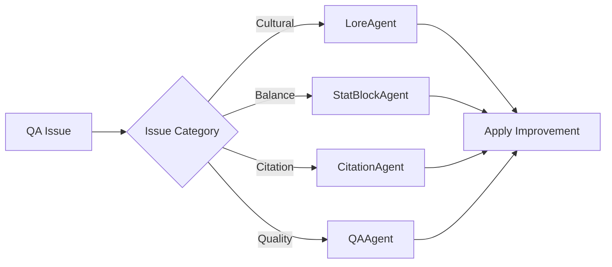
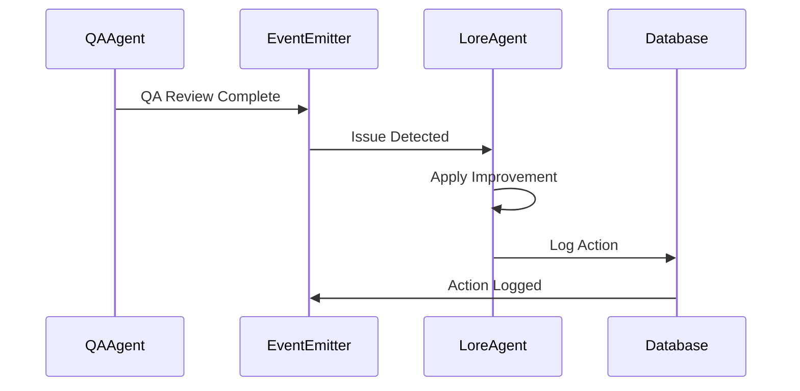
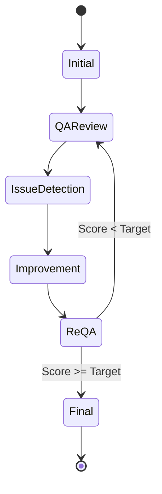

# Design Patterns in the Refinement Process

The Folklore monster generation system uses several software design patterns to create a flexible, maintainable, and observable refinement process.

## Overview

Our refinement process combines multiple design patterns to handle the complex task of improving AI-generated content through iterative feedback loops.

## Chain of Responsibility Pattern

### Purpose
Each agent in the pipeline handles specific types of feedback based on issue categories.

### Implementation
```typescript
// Each agent can handle specific issue types
LoreAgent → StatBlockAgent → CitationAgent → QAAgent → RefinementPipeline
```

### Diagram


### Benefits
- **Decoupled**: Agents don't need to know about each other
- **Extensible**: Easy to add new agents for new issue types
- **Maintainable**: Each agent has a single responsibility

## Strategy Pattern

### Purpose
Different improvement strategies for different issue types.

### Implementation
```typescript
interface RefinementStrategy {
  applyImprovement(monster: Monster, issue: QAIssue): Promise<Improvement>
}

class LoreRefinementStrategy implements RefinementStrategy {
  async applyImprovement(monster: Monster, issue: QAIssue): Promise<Improvement> {
    // Handle cultural and consistency issues
  }
}

class StatBlockRefinementStrategy implements RefinementStrategy {
  async applyImprovement(monster: Monster, issue: QAIssue): Promise<Improvement> {
    // Handle balance and CR issues
  }
}
```

### Benefits
- **Flexible**: Easy to swap strategies
- **Testable**: Each strategy can be tested independently
- **Reusable**: Strategies can be reused across different contexts

## Observer Pattern (Event-Driven)

### Purpose
Decoupled communication between components through events.

### Implementation
```typescript
// QA results trigger agent responses
QAReview → EventEmitter → Agent Updates → Database Logging
```

### Diagram


### Benefits
- **Decoupled**: Components don't directly depend on each other
- **Extensible**: Easy to add new event listeners
- **Observable**: All events are tracked for analysis

## State Machine Pattern

### Purpose
Clear state transitions in the refinement process.

### Implementation
```typescript
enum RefinementState {
  INITIAL = 'initial',
  QA_REVIEW = 'qa_review',
  ISSUE_DETECTION = 'issue_detection',
  IMPROVEMENT = 'improvement',
  RE_QA = 're_qa',
  FINAL = 'final'
}
```

### Diagram


### Benefits
- **Predictable**: Clear state transitions
- **Controllable**: Prevents invalid state transitions
- **Trackable**: Each state is logged and persisted

## Pipeline Pattern

### Purpose
Modular processing stages for data transformation.

### Implementation
```typescript
// Data flows through processing stages
Monster → Agents → QA → Refinement → Database → PDF
```

### Benefits
- **Modular**: Each stage can be developed independently
- **Reusable**: Stages can be reused in different pipelines
- **Testable**: Each stage can be tested in isolation

## Pattern Interaction

These patterns work together to create a robust refinement system:

1. **Chain of Responsibility** routes issues to appropriate agents
2. **Strategy Pattern** provides different improvement approaches
3. **Observer Pattern** enables decoupled communication
4. **State Machine** ensures valid process flow
5. **Pipeline Pattern** organizes the overall process

### Combined Benefits
- **Flexibility**: Easy to add new agents or strategies
- **Testability**: Each component can be tested independently
- **Scalability**: Can add more agents or strategies easily
- **Maintainability**: Clear separation of concerns
- **Observability**: Full logging and state tracking

## Conclusion

The combination of these design patterns creates a flexible, observable, and maintainable refinement system that can easily adapt to new requirements and scale with the application's needs. 