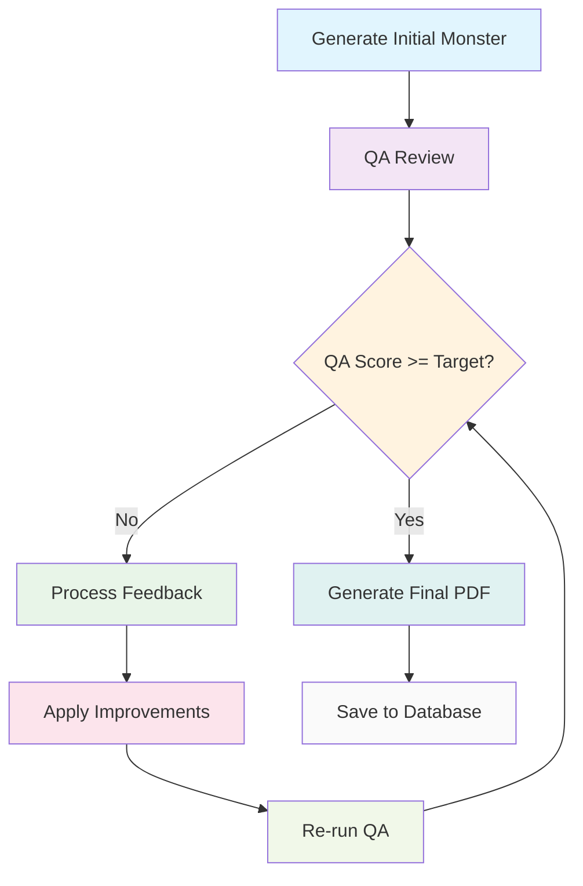
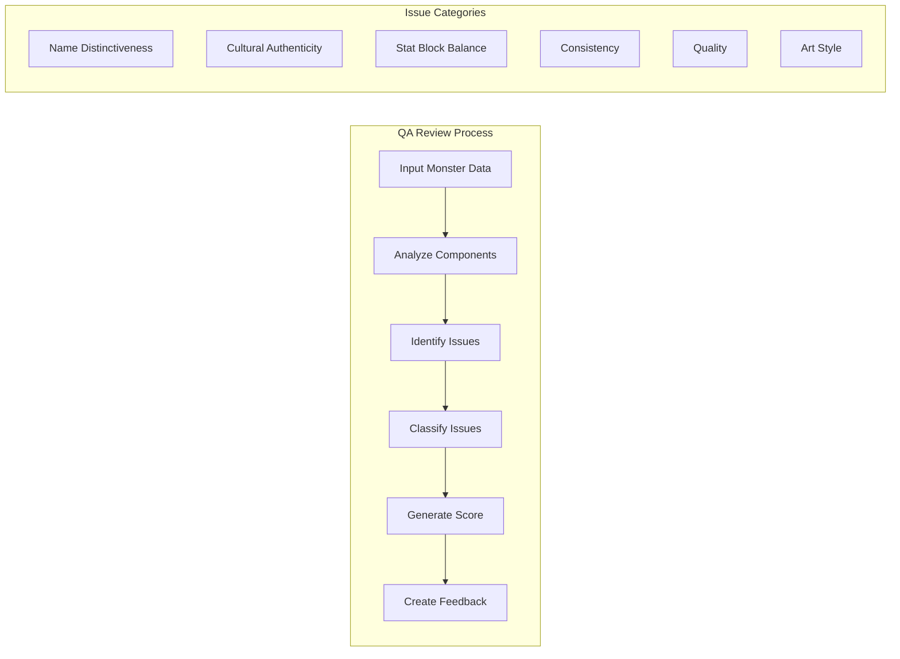
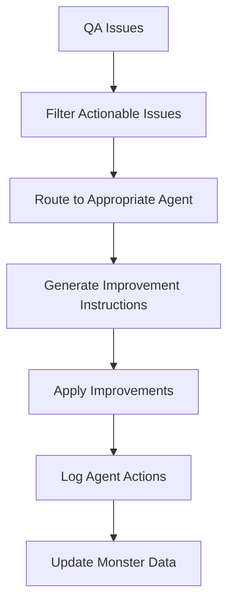
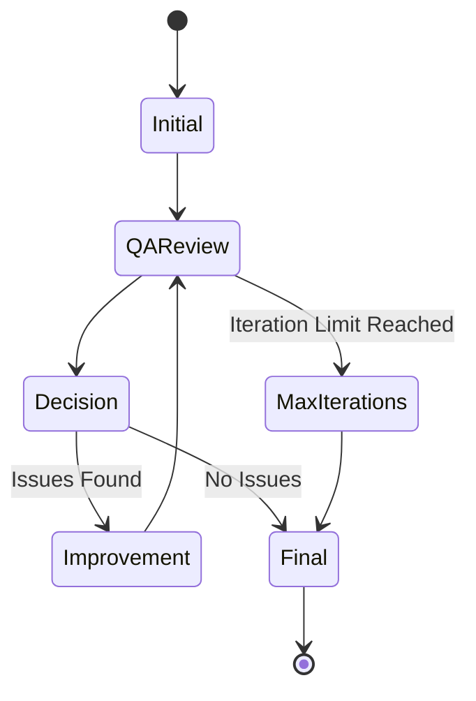

# Refinement Pipeline Overview

The refinement pipeline is the core quality assurance system that iteratively improves AI-generated monsters through feedback loops and intelligent issue classification.

## Pipeline Overview

### High-Level Flow



## Detailed Process Flow

### 1. Initial Generation
The pipeline starts with a complete monster generation:
- **Lore Agent**: Creates cultural lore and monster description
- **StatBlock Agent**: Generates D&D 5.1 SRD-compatible stat block
- **Citation Agent**: Provides academic citations and references
- **ArtPrompt Agent**: Creates art prompts for image generation

### 2. QA Review
The QA Agent performs comprehensive quality assessment:



### 3. Issue Classification
Issues are classified by severity and category:

#### Severity Levels
- **Critical**: Must be fixed before proceeding
- **Major**: Significant issues affecting quality
- **Minor**: Small improvements that enhance quality

#### Issue Categories
- **Name Distinctiveness**: Generic names like "Troll", "Dragon"
- **Cultural Authenticity**: Cultural inaccuracies or stereotypes
- **Stat Block Balance**: Challenge rating or ability score issues
- **Consistency**: Contradictions between lore and stats
- **Quality**: Writing quality, completeness, engagement
- **Art Style**: Visual description and style consistency

### 4. Feedback Processing



### 5. Agent-Specific Improvements

#### Lore Agent Improvements
- **Name Issues**: Generate more distinctive names
- **Cultural Issues**: Improve cultural authenticity
- **Consistency Issues**: Fix contradictions in lore
- **Quality Issues**: Enhance writing quality

#### StatBlock Agent Improvements
- **Balance Issues**: Adjust challenge rating and abilities
- **Consistency Issues**: Align stats with lore
- **Quality Issues**: Improve stat block completeness

#### ArtPrompt Agent Improvements
- **Style Issues**: Enhance visual descriptions
- **Cultural Issues**: Improve cultural representation
- **Quality Issues**: Better art prompt generation

### 6. Iteration Control



#### Stopping Criteria
- **Success**: QA score reaches target (default: 4.0/5.0)
- **Max Iterations**: Reached maximum iterations (default: 3)
- **No Improvements**: QA score doesn't improve after iteration
- **Error**: Critical error in refinement process

## Configuration Options

### Pipeline Settings
```typescript
interface RefinementConfig {
  maxIterations: number;        // Default: 3
  targetQAScore: number;        // Default: 4.0
  enableLogging: boolean;       // Default: true
  enablePersistence: boolean;   // Default: true
  delayPDFGeneration: boolean;  // Default: true
}
```

### QA Score Thresholds
- **Excellent**: 4.5-5.0 (No refinement needed)
- **Good**: 4.0-4.4 (Minor refinement possible)
- **Fair**: 3.0-3.9 (Significant refinement needed)
- **Poor**: 0.0-2.9 (Major issues require attention)

## Session Tracking

### Refinement Session Data
```typescript
interface RefinementSession {
  id: string;
  monsterId: string;
  initialQAScore: number;
  finalQAScore: number;
  iterations: number;
  success: boolean;
  startTime: Date;
  endTime: Date;
  agentActions: AgentAction[];
}
```

### Agent Action Logging
```typescript
interface AgentAction {
  agentName: string;
  feedbackReceived: string;
  actionTaken: string;
  durationMs: number;
  success: boolean;
}
```

## Performance Characteristics

### Timing
- **Initial Generation**: 30-60 seconds
- **QA Review**: 10-15 seconds
- **Improvement Application**: 15-30 seconds per iteration
- **Total Refinement**: 1-3 minutes for typical cases

### Success Rates
- **First Pass Success**: ~40% (no refinement needed)
- **One Iteration Success**: ~80% (one refinement cycle)
- **Two Iteration Success**: ~95% (two refinement cycles)
- **Three Iteration Success**: ~98% (three refinement cycles)

## Error Handling

### Common Issues
- **Agent Failures**: Retry with exponential backoff
- **QA Score Regression**: Rollback to previous version
- **Database Errors**: Log error and continue
- **Timeout Issues**: Extend timeout or fail gracefully

### Recovery Strategies
- **Automatic Retry**: Retry failed operations
- **Fallback Agents**: Use alternative agents if primary fails
- **Partial Success**: Save partial results if possible
- **Error Logging**: Comprehensive error tracking

## Monitoring and Analytics

### Key Metrics
- **Success Rate**: Percentage of successful refinements
- **Average Iterations**: Mean iterations per refinement
- **QA Score Improvement**: Average score improvement
- **Agent Performance**: Success rates per agent
- **Common Issues**: Most frequent issue categories

### Real-time Monitoring
- **Active Sessions**: Currently running refinements
- **Queue Status**: Pending refinement requests
- **Agent Status**: Health of individual agents
- **Performance Metrics**: Response times and throughput

## Future Enhancements

### Planned Improvements
- **Advanced Issue Classification**: Machine learning-based classification
- **Predictive Refinement**: Predict needed improvements
- **Multi-Agent Coordination**: Simultaneous agent improvements
- **Custom Refinement Strategies**: User-defined improvement rules

### Research Areas
- **Optimal Stopping Criteria**: Dynamic threshold adjustment
- **Agent Selection**: Intelligent agent routing
- **Feedback Quality**: Improving feedback effectiveness
- **Cost Optimization**: Balancing quality vs. cost

## Conclusion

The refinement pipeline provides a sophisticated quality assurance system that continuously improves AI-generated content through intelligent feedback loops. The system balances quality improvement with computational efficiency while maintaining comprehensive observability and error recovery capabilities. 